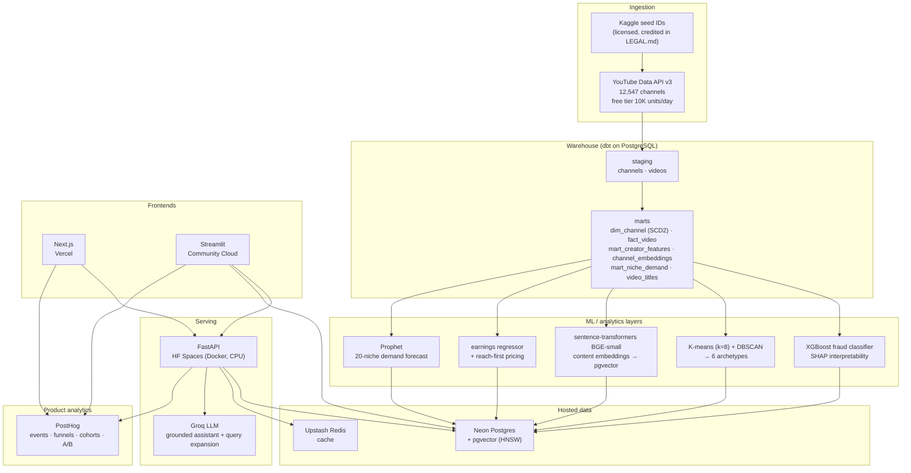

# Architecture — CreatorPulse India

CreatorPulse is a dual-persona creator-economy intelligence product: **creators** analyze
their own channel; **brands** find and screen creators for campaigns. The system indexes
**12,547 Indian YouTube channels** (seed IDs from a licensed Kaggle list, all stats fetched
live via the official YouTube Data API v3 — see `LEGAL.md`), derives features and ML signals
in a dbt warehouse, and serves them through a FastAPI service consumed by two frontends.

Canonical numbers (single source of truth in `05_CreatorPulse.md`): **12,547 creators · 20
niches · 6 archetypes** (8-cluster K-means collapsed to 6 interpretable labels).

## System diagram

## Components

**Ingestion.** Seed channel IDs come from a licensed Kaggle list (attribution in `LEGAL.md`);
all channel/video statistics are fetched live from the official **YouTube Data API v3** (free
tier, 10K units/day). No scraping — identifiers-as-seeds, stats-from-API.

**Warehouse (dbt on PostgreSQL).** Staging models clean raw API pulls; marts hold the
analytical layer — `dim_channel` (SCD2), `fact_video`, `mart_creator_features`,
`channel_embeddings` (pgvector), `mart_niche_demand`, and a lean `video_titles` lookup. dbt
tests enforce referential integrity and accepted ranges.

**ML / analytics layers.**
- **XGBoost fraud classifier** — engagement-authenticity scoring on heuristic-labeled
  features; SHAP for interpretability. F1 validated against a simulated cohort.
- **K-means (k=8) + DBSCAN** — content-embedding clustering, collapsed to **6 interpretable
  archetypes** via a label map.
- **sentence-transformers (BGE-small)** — content embeddings stored in pgvector (HNSW index)
  for semantic brand-creator match.
- **Earnings regressor + reach-first pricing** — sponsored-cost estimation (median views ×
  niche CPM band × format multiplier, subscriber-floored, ₹50L-capped, `cost_basis`-labeled).
- **Prophet** — per-niche demand forecasting across 20 niches.

**Serving (FastAPI on HF Spaces).** A CPU Docker Space exposes `/creators`, `/match`, `/chat`,
`/feedback`, `/stats`. The **Groq**-backed assistant is knowledge-grounded (not RAG) with a
deterministic missing-channel handler (ADR-0036). Reads Neon; caches in Upstash.

**Hosted data.** **Neon Postgres + pgvector** is the single hosted store both the Space and the
Streamlit app read (a cloud API cannot reach a local Docker DB). **Upstash Redis** caches hot
reads.

**Frontends.**
- **Next.js on Vercel** — primary product UI; calls the FastAPI service.
- **Streamlit on Community Cloud** — dual-persona analyst app; brand match calls the deployed
  `/match` API (torch-free frontend, ADR-0037), creator page reads Neon directly.

**Product analytics (PostHog).** Server-side (`/feedback` → `chat_feedback`) plus Streamlit
event instrumentation — 12 events, dual funnels (creator + brand), retention cohorts, and one
A/B feature flag on match ranking. Pre-launch results are validated against a simulated cohort.

## Deployment surfaces

| Surface | Host | Notes |
|---|---|---|
| API | Hugging Face Spaces (Docker, CPU) | Builds from GitHub HEAD; `DATABASE_URL` as Space secret |
| Web UI | Vercel (Next.js) | `NEXT_PUBLIC_API_URL` baked at build |
| Analyst app | Streamlit Community Cloud | Torch-free; Neon + `API_URL` + PostHog in Cloud secrets |
| Database | Neon Postgres + pgvector | HNSW index for match |
| Cache | Upstash Redis | Hot-read cache |
| Analytics | PostHog Cloud (US) | Server-side + app events |

See `docs/decisions.md` for the ADR trail behind these choices.
