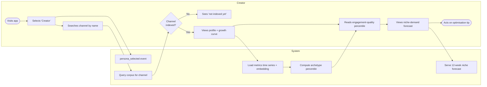
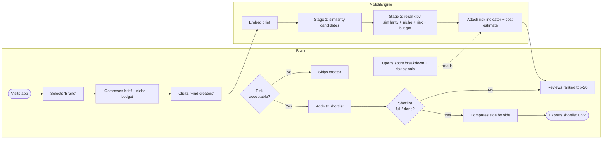
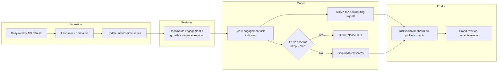

# Process Maps — CreatorPulse India

BPMN-style swim-lane diagrams for the three headline journeys, rendered in Mermaid (GitHub renders these inline). Each lane is a subgraph representing an actor or system. Diamonds are decision gateways.

---

## 1. Creator onboarding & analysis journey

---

## 2. Brand campaign-launch journey

---

## 3. Engagement-risk feedback loop

---

*Notes: lanes are modelled as Mermaid subgraphs (BPMN pools/lanes); decision gateways are diamonds. The risk indicator is reported as risk-on-public-signals, never platform-verified fraud, consistent with `FRD.md` F14 and the model card.*
